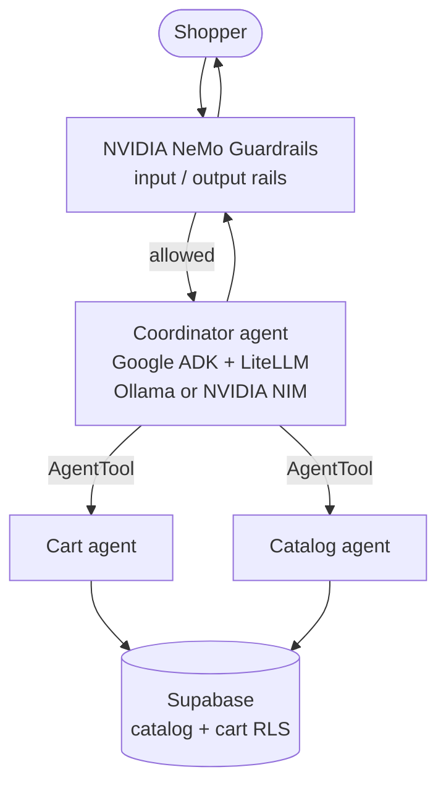

# Multi-Agent Customer Support

A multi-agent **e-commerce shopping assistant** that routes shopper requests through a coordinator to specialized catalog and cart agents, backed by **Supabase**.


## Built with

| Stack | Role in this project |
|-------|----------------------|
| [**Google ADK**](https://google.github.io/adk-docs/) (Agent Development Kit) | Multi-agent runtime: coordinator + sub-agents, `AgentTool` delegation, tool execution |
| [**NVIDIA NeMo Guardrails**](https://github.com/NVIDIA-NeMo/Guardrails) | Safety **perimeter** on the console app: off-topic (FastEmbed), jailbreak self-check, Llama Guard moderation |
| [**NVIDIA NeMo Agent Toolkit (NAT)**](https://docs.nvidia.com/nemo/agent-toolkit/) | Same workflow packaged for `nat run` / `nat eval`, profiling, and custom routing evaluation |
| [**NVIDIA NIM**](https://build.nvidia.com/) | **Production** inference — same OpenAI-compatible `base_url` / API key as dev |
| [**Ollama**](https://ollama.com/) | **Development & testing** — local OpenAI-compatible endpoint |
| **Supabase** | Product catalog, cart, RLS |

**Model serving:** ADK agents, NeMo Guardrails, and NAT all talk to models through **OpenAI-compatible HTTP APIs** (Google ADK + LiteLLM). There is no separate NIM code path — for production, point `BASE_URL` and `API_KEY` at your [NVIDIA NIM](https://build.nvidia.com/) endpoint (see [Model serving](#model-serving-ollama-vs-nvidia-nim)). This can be set using the `PROVIDER` variable set to `ollama` or `nim`.

## Architecture



| Layer | Role |
|-------|------|
| `multi_agent/coordinator_agent` | Routes shopper intent to cart or catalog specialists |
| `multi_agent/sub_agents/cart_agent` | Cart CRUD, coupons (test user, RLS) |
| `multi_agent/sub_agents/catalog_agent` | Search, product details, reviews |
| `multi_agent/tools` | Supabase clients and tool envelopes |
| `multi_agent/guardrails` | NVIDIA NeMo Guardrails: FastEmbed off-topic, gemma3:4b self-check, llama-guard3 |
| `multi_agent/nat_app` | NVIDIA NAT workflow registration (`store_assistant`) |

Package layout: all application code lives under `multi_agent/`. Configuration (`.env`) and packaging (`pyproject.toml`) sit at the repository root.

## Model serving: Ollama vs NVIDIA NIM

Everything uses the same wiring: an OpenAI-compatible **`base_url`** and **API key** read from `.env`. Swap the endpoint for production — no alternate NAT workflow or ADK integration required.

| Environment | `OLLAMA_BASE_URL` | `OLLAMA_API_KEY` |
|-------------|-------------------|------------------|
| **Development** | `http://localhost:11434` (Ollama) | `ollama` (or your local placeholder) |
| **Production** | `https://integrate.api.nvidia.com/v1` ([NVIDIA NIM](https://build.nvidia.com/)) | Your `nvapi-...` key |

That single change applies to:

- **Google ADK agents** — `LiteLlm(..., base_url=..., api_key=...)` in `coordinator_agent` and sub-agents
- **NVIDIA NeMo Guardrails** — `base_url: ${OLLAMA_BASE_URL}` in `multi_agent/guardrails/config.yml`
- **NVIDIA NAT** — `base_url` / `api_key` in `multi_agent/nat_app/configs/*.yml` (same env vars)

**Local models (Ollama)** — pull the tags referenced in code/config, for example:

- `gemma4:26b` — ADK coordinator + catalog + cart agents
- `gemma3:4b` — NeMo Guardrails self-check rails
- `llama-guard3` — NeMo Guardrails Llama Guard moderation

**NIM (production)** — after pointing `OLLAMA_BASE_URL` at NIM, set **model names** to the NIM model IDs you deploy (e.g. in agent `LiteLlm(model=...)` and NAT `model_name:`). LiteLLM routes via the OpenAI-compatible API at `base_url`; the repo does not use ADK’s separate `nim` integration (which can drop tools).

## Prerequisites

- **Python 3.11+**
- **Google ADK** and **LiteLLM** (installed via `pip install -e .`)
- **NVIDIA NeMo Guardrails** (console entrypoint with safety rails)
- **NVIDIA NeMo Agent Toolkit (NAT)** — optional, for `nat run` / `nat eval`
- **Model endpoint:** [Ollama](https://ollama.com/) locally, or [NVIDIA NIM](https://build.nvidia.com/) in production — same `OLLAMA_BASE_URL` / `OLLAMA_API_KEY` env vars
- **Supabase** project with catalog/cart schema and RLS for your test user

## Install

From the repository root:

```bash
python3.11 -m venv .venv
source .venv/bin/activate   # Windows: .venv\Scripts\activate
pip install -e .

cp .env.example .env
# Edit .env — Supabase + model base URL (Ollama locally, NIM in production)
```

For tests and manual tool debugging:

```bash
pip install pytest rich
```

For NAT profiling and evaluation:

```bash
pip install nvidia-nat
```

## Environment variables

Copy `.env.example` to `.env` at the **repo root** (not inside `multi_agent/`). Variables:

| Variable | Purpose |
|----------|---------|
| `OLLAMA_BASE_URL` | OpenAI-compatible API base — Ollama (`http://localhost:11434`) or [NVIDIA NIM](https://integrate.api.nvidia.com/v1) |
| `OLLAMA_API_KEY` | API key for that base — `ollama` locally, `nvapi-...` for NIM |
| `SUPABASE_URL` | Supabase project URL |
| `SUPABASE_SERVICE_KEY` | Service role key (catalog admin reads; bypasses RLS) |
| `SUPABASE_ANON_KEY` | Anon key for authenticated test-user cart operations |
| `TEST_USER_EMAIL` | Shopper account for cart tools under RLS |
| `TEST_USER_PASSWORD` | Password for that test user |

`multi_agent/tools/_client.py` loads `.env` from the repository root automatically.

## Run

### Console assistant (NeMo Guardrails + Google ADK)

```bash
python -m multi_agent.main
```

### ADK web UI

From the repo root, point ADK at the package entry module:

```bash
adk web --agent multi_agent.agent
```

(`multi_agent.agent` re-exports `root_agent` from the coordinator.)

### NAT workflow

After `pip install nvidia-nat` and `pip install -e .`:

```bash
nat run --config_file multi_agent/nat_app/configs/config.yml --input "Show me running shoes under $100"
```

Evaluation (optional dataset + custom routing evaluator):

```bash
set -a && source .env && set +a   # or: export $(grep -v '^#' .env | xargs)
nat eval --config_file multi_agent/nat_app/configs/eval_config.yml
```

### Latency benchmark

```bash
python -m multi_agent.bench_latency
```

## Tests

```bash
pytest multi_agent/tests/
```

Integration tests (`test_cart`, `test_catalog`) call live Supabase with credentials from `.env`. `test_catalog_cache.py` is unit-only.

## Security

- **Never commit** `.env`, `demo_credentials.json`, or real API keys. Both are listed in `.gitignore`.
- `SUPABASE_SERVICE_KEY` bypasses RLS — use only in trusted environments and catalog tooling, not end-user sessions.
- Cart tools sign in as `TEST_USER_EMAIL`; production would use per-user JWTs instead of a shared test account.
- Guardrails reduce risk but do not replace auth, rate limits, or server-side validation on Supabase policies.

## License

This project is licensed under the [MIT License](LICENSE).

## Acknowledgments

- **Google** — [Agent Development Kit (ADK)](https://google.github.io/adk-docs/) for the multi-agent framework
- **NVIDIA** — [NeMo Guardrails](https://github.com/NVIDIA-NeMo/Guardrails), [NeMo Agent Toolkit (NAT)](https://docs.nvidia.com/nemo/agent-toolkit/), and [NIM](https://build.nvidia.com/) for safety, evaluation, and production inference
